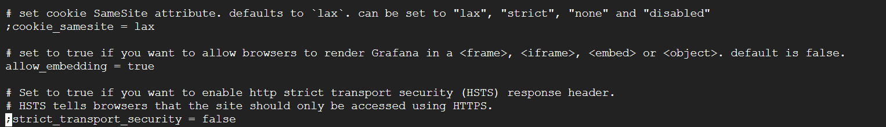

# Grafana-SPAD-IoT
En este repositorio se da una explicacion de la herramienta de visualizacion grafica Grafana, los requerimientos para realizar pruebas de forma local, su conexion con la base de datos no relacional Cassandra y los pasos de conexion necesarios para conectar Grafana con la aplicacion SPAD-IoT y su posterior visualizacion de datos.

## Index

1. [Descripción](#Descripción)
2. [Grafana en el entorno local con datos de prueba](#Grafana-en-el-entorno-local-con-datos-de-prueba)
3. [Grafana como herramienta de visualizacion en SPAD-IoT](#Grafana-como-herramienta-de-visualizacion-en-SPAD-IoT)

## Descripción

Grafana permite la visualización de datos métricos y es un software de versión libre con licencia de Apache 2.0. Con esta herramienta se puede monitorizar los datos provenientes de diferente tipo de fuentes, por ejemplo, bases de datos relacional como MySQL, InfluxDB o bases no Relacional como MongoDB. Para este proyecto se hara especial enfasis en la base de Datos Cassandra CQL.

## Grafana en el entorno local con datos de prueba

Lo primero que debemos instalar para familiarizarnos con el entorno de Grafana es la aplicación Grafana Lab con la edición Enterprise, para los usuarios de linux-Ubuntu, seguir los siguientes pasos:

` sudo apt-get install -y adduser libfontconfig1 musl`

` wget https://dl.grafana.com/enterprise/release/grafana-enterprise_10.3.3_amd64.deb`

` sudo dpkg -i grafana-enterprise_10.3.3_amd64.deb`

Una vez instalado Grafana correctamente, podra acceder a su interfaz escribiendo en el navegador:

`localhost:3000"`

Si la instalacion fue correcta vera la siguiente ventana:

El usuario y contraseña por defecto son:

` username:admin`

` password:admin`

Una vez logueado podra ver el home de Grafana.

El siguiente paso es instalar la base de datos usada como prueba Cassandra DB, para esto se recomienda usar la interfaz de Datastax.

` sudo apt install apt-transport-https wget gnupg`

` sudo apt install openjdk-8-jdk`

` wget -q -O - https://www.apache.org/dist/cassandra/KEYS | sudo apt-key add -`

`sudo sh -c 'echo "deb http://www.apache.org/dist/cassandra/debian 311x main" > /etc/apt/sources.list.d/cassandra.list'`

`sudo apt-get update`

`sudo apt install cassandra`

Una vez instalado CassandraDB en la computadora, es necesario instalar el conector de la BD en Grafana y configurarlo.

Una vez configurado el conector, podra hacer consultas CQL con editor de query o usar la intefaz de Grafana para visualizar los datos de la DB Cassandra:

## Grafana como herramienta de visualizacion en SPAD-IoT

Se usa la versión 9.5.14 de grafana ya que la ultima versión aun genera algunos errores con el conector de cassandra, la versión usada del conector es la 2.3.0 

Conector de [Cassandra 2.3.0](https://github.com/HadesArchitect/GrafanaCassandraDatasource/releases/download/2.3.0/cassandra-datasource-2.3.0.zip)

Para el despliegue de la herramienta se usan dos volumenes, uno para pasarle la conexion con cassandra y la otra para establecer la conexion segura con la base de datos.

Docker compose Grafana.

Se deben realizar tres configuraciones para el correcto funcionamiento de la herramienta:

### 1. Paso 1
Se debe configurar el conector de Cassandra en el DataSource de Grafana.

`Host: 54d91226-1193-4ef8-963e-cd02b29c5874-useast1.db.astra.datastax.com:29042`

`User: bYsgtOQohRgnamBftGIZAcDD `

`Password: 3uFOQU-S4amR_2tmcrBzsTJD91E9PDebew.kjjuH92+a73.lJy6Zj7IZZiJxPLuxOQF42HPtfD.wX0rmFMMuy1SLOC4fXh-Pu2RRhQ_02phwFdR1O_5aAgmUbLgItPSM `

### 2. Paso 2
La segunda configuracion permite que la aplicacion sea visible desde el nginx de SPAD, para ello se debe ingresar al docker y en la ruta /etc/grafana/ ingresar al archivo grafana.ini, dejar las siguientes lineas de código igual a la imagen:

### 3.Paso 3
La tercera configuración es la que permite ingresar desde la url de spad sin la necesidad de autenticarnos en la aplicación, se debe configurar el mismo archivo anterior /etc/grafana ingresar al archivo grafana.ini

A los cambios anteriores se deben sumar los siguientes:

Para no cambiar el localhost:3000 de Grafana

`enforce_domain = false `

Para embeber la aplicacion dentro del menu de SPAD

`allow_embedding = true`

Con todos los pasos anteriores el archivo grafana.ini deberia tener las siguientes modificaciones:

### grafana.ini

`enabled = true`

`;header_name = X-WEBAUTH-USER`

`;header_property = username`

`auto_sign_up = true`

`;sync_ttl = 60`

`;whitelist = 127.0.0.1`

`;headers = Email:X-User-Email, Name:X-User-Name`

`# Non-ASCII strings in header values are encoded using quoted-printable encoding`

`;headers_encoded = false`

`# Read the auth proxy docs for details on what the setting below enables`

`;enable_login_token = true`

`enforce_domain = false`

`allow_embedding = true`

### Error del conector

1. Si los paneles son visibles pero no hay datos en su interior, lo mas seguro es la perdida del conecto con la base de datos Cassandra. Lo primero sera navegar, dentro del escritorio remoto, a la maquina de SpadWeb en la direccion http://172.16.110.62:3001/, la cual corresponde a la herramienta de visualizacion Grafana. Dentro de la maquina, buscar la opcion "your connections" y entrar alli como se muestra en la imagen a contiuacion:

2. El siguiente paso es configurar las opciones de conexion como se muestra en la imagen a continuacion:

3. Finalmente comprobar que las opciones de TLS esten correctamente configuradas, la siguiente imagen ilustra la correcta configuracion:

Parametros de configuracion:

` "host": "54d91226-1193-4ef8-963e-cd02b29c5874-us-east1.db.astra.datastax.com:29042"`

` "clientId": "bYsgtOQohRgnamBftGIZAcDD" `

` "secret": "3uFOQU-S4amR_2tmcrBzsTJD91E9PDebew.kjjuH92+a73.lJy6Zj7IZZiJxPLuxOQF42HPtfD.wX0rmFMMuy1SLOC4fXh-Pu2RRhQ_02phwFdR1O_5aAgmUbLgItPSM" `
 

# Para tener presente: Si se baja el contenedor, se borrara toda la configuracion que no este en el docker-compose.
